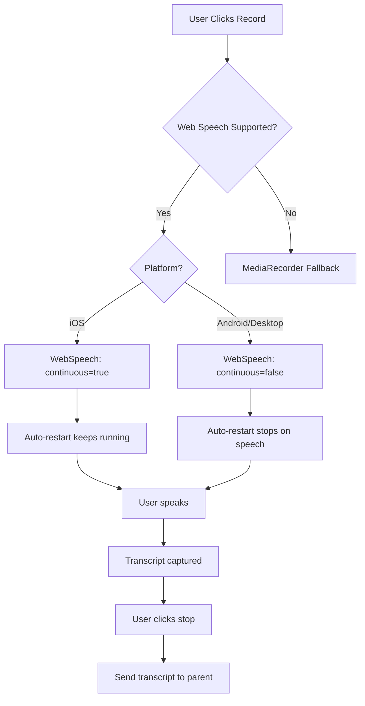

# Audio Recording - Technical Notes & Solutions

## Overview
Dokumentasi ini berisi catatan teknis tentang implementasi voice recording menggunakan Web Speech API di HaloDompet, termasuk masalah-masalah yang ditemukan dan solusinya.

---

## Platform Support

### ✅ Web Speech API (Primary Method)
- **Support**: iOS Safari, Android Chrome, Desktop Chrome/Edge
- **Advantages**: Real-time transcription, instant results, no server processing
- **Disadvantages**: Platform-specific behavior, short timeout

### 🔄 MediaRecorder API (Fallback)
- **Support**: Firefox, Safari Desktop, browsers without Web Speech
- **Advantages**: Universal support, reliable recording
- **Disadvantages**: Requires server-side STT (Gemini API), slower

---

## Critical Issues & Solutions

### 🐛 Issue #1: "no-speech" Error - Timeout Too Short

**Problem:**
Web Speech API has a very short timeout (3-5 seconds). If user doesn't speak immediately after clicking record, it throws `no-speech` error and stops.

**Symptoms:**
```
❌ Recognition error: no-speech
Error message: Tidak mendengar suara. Coba lagi!
```

**Root Cause:**
WebSpeech API is designed for short voice commands, not continuous recording. It automatically stops if no speech detected within 3-5 seconds.

**Solution:**
Auto-restart mechanism when `no-speech` error occurs:

```typescript
recognition.onerror = (event: any) => {
  if (event.error === 'no-speech' && shouldBeListeningRef.current) {
    restartCountRef.current++

    // Prevent infinite loop (max 20 restarts = ~1 minute)
    if (restartCountRef.current > 20) {
      // Stop and show error
      return
    }

    // Auto-restart after 100ms
    setTimeout(() => {
      if (shouldBeListeningRef.current) {
        recognitionRef.current.start()
      }
    }, 100)
    return
  }
}
```

**Key Points:**
- Auto-restart continues until user speaks or manually stops
- Max 20 restarts prevents infinite loop (~1 minute total)
- Transcript accumulates across restarts (not cleared)
- User can take their time before speaking

---

### 🐛 Issue #2: Duplicate Transcription on Android

**Problem:**
Android shows duplicate text like "beli beli beli beli indomie indomie" instead of "beli indomie".

**Symptoms:**
Every word repeated multiple times in transcript.

**Root Cause:**
With `continuous: true`, Android's WebSpeech implementation keeps re-capturing the same audio segment multiple times during auto-restart cycles.

**Solution:**
Use `continuous: false` for Android/Desktop to prevent duplicate capture:

```typescript
// Android/Desktop needs continuous=false
recognition.continuous = false

// Stop auto-restart once speech detected
recognition.onresult = (event: any) => {
  shouldBeListeningRef.current = false  // Stop auto-restart
  restartCountRef.current = 0
  // Process transcript...
}
```

**Key Points:**
- `continuous: false` makes recognition stop after capturing one phrase
- Auto-restart stops immediately when speech is detected
- Prevents re-capturing the same audio
- Works perfectly for Android and Desktop

---

### 🐛 Issue #3: iOS Not Capturing Transcript

**Problem:**
iOS records audio but shows "Tidak ada suara terdeteksi" when stopping. No transcript returned.

**Symptoms:**
- Microphone icon shows recording (active)
- Audio is being captured
- When stopped, no transcript appears
- Error: "Tidak ada suara terdeteksi"

**Root Cause:**
iOS WebSpeech requires `continuous: true` to capture complete transcript. With `continuous: false`, iOS stops too early before finalizing the transcript.

**Solution:**
Platform-specific configuration based on device detection:

```typescript
import { isIOSDevice } from '@/lib/utils'

const isIOS = isIOSDevice()
isIOSRef.current = isIOS

// iOS needs continuous=true to capture full transcript
// Android/Desktop needs continuous=false to prevent duplicates
recognition.continuous = isIOS ? true : false

recognition.onresult = (event: any) => {
  // Android/Desktop: stop auto-restart (prevents duplicates)
  // iOS: keep auto-restart running (continuous mode needs it)
  if (!isIOSRef.current) {
    shouldBeListeningRef.current = false
    restartCountRef.current = 0
  }
  // ... process transcript
}
```

**Key Points:**
- iOS requires `continuous: true`
- iOS should NOT stop auto-restart when result received
- Android/Desktop requires `continuous: false`
- Android/Desktop should stop auto-restart when result received

---

## Platform-Specific Behavior Matrix

| Platform | continuous | Auto-Restart on Result | Why |
|----------|-----------|----------------------|-----|
| **iOS** | `true` | Keep Running | iOS needs continuous mode to finalize transcript. Stopping auto-restart too early causes empty results. |
| **Android** | `false` | Stop Immediately | Android re-captures same audio with continuous=true. Must stop auto-restart to prevent duplicates. |
| **Desktop/Web** | `false` | Stop Immediately | Similar to Android. Prevents duplicate capture. |

---

## Implementation Architecture

### File Structure
```
components/
├── RecordButton.tsx          # Main router component
├── AnimatedRecordButton.tsx  # UI/Animation component
├── WebSpeechRecorder.tsx     # Web Speech API implementation ⭐
├── MediaRecorderButton.tsx   # MediaRecorder fallback
├── IOSMediaRecorder.tsx      # iOS MediaRecorder fallback
└── WebAudioRecorder.tsx      # Experimental (not used)

lib/
└── utils.ts                  # Platform detection utilities
```

### Recording Flow



### Platform Detection Logic

```typescript
// RecordButton.tsx - Main router
if (isSpeechRecognitionSupported()) {
  // All platforms with Web Speech support
  setRecorderType('webspeech')
} else if (isIOSDevice()) {
  // iOS fallback if Web Speech not available
  setRecorderType('ios')
} else {
  // Firefox, Safari Desktop, others
  setRecorderType('mediarecorder')
}
```

---

## Best Practices

### ✅ DO:

1. **Use Web Speech API as primary method**
   - Fastest, most accurate for real-time transcription
   - No server processing required
   - Best UX for supported platforms

2. **Implement auto-restart for no-speech timeout**
   - Gives users time to think before speaking
   - Makes it feel like a normal voice recorder
   - Add max restart limit to prevent infinite loops

3. **Use platform-specific configuration**
   - iOS: `continuous: true` + keep auto-restart running
   - Android/Desktop: `continuous: false` + stop auto-restart on speech

4. **Detect platform at runtime**
   - User agent detection in client-side only
   - Store in ref for consistent behavior
   - Don't rely on SSR detection (always false)

5. **Accumulate transcript across restarts**
   - Don't clear `finalTranscriptRef` during auto-restart
   - Only clear when user manually stops or starts new recording

### ❌ DON'T:

1. **Don't use same config for all platforms**
   - iOS and Android have different behaviors
   - One-size-fits-all approach will fail on some platform

2. **Don't clear transcript on auto-restart**
   - Users expect their full speech to be captured
   - Clearing causes loss of earlier spoken text

3. **Don't show error on every no-speech timeout**
   - It's expected during auto-restart
   - Only show error after max retries exceeded

4. **Don't use too many console.log in production**
   - Keep only essential error logging
   - Remove debug logs before deployment

5. **Don't rely on continuous mode alone**
   - Must combine with auto-restart for good UX
   - Platform-specific tuning required

---

## Debugging Tips

### Enable Console Logging

When debugging issues, check browser console for these key events:

```javascript
// Good debug points (keep these during development):
console.log('🎤 WebSpeech: handleListen called')
console.log('✅ WebSpeech API detected')
console.log('🎙️ Recognition started')
console.log('📝 Recognition result received')
console.log('⏹️ Recognition ended')
console.error('❌ Recognition error:', event.error)

// Remove verbose logging in production:
// - Individual result details
// - Transcript accumulation steps
// - Auto-restart notifications
```

### Testing Checklist

**iOS Testing:**
- [ ] Mic permission granted
- [ ] Can record without speaking immediately
- [ ] Transcript appears after speaking
- [ ] Can record multiple phrases in one session
- [ ] Manually stopping works correctly
- [ ] No "tidak ada suara" error when transcript exists

**Android Testing:**
- [ ] Mic permission granted
- [ ] Can record without speaking immediately
- [ ] No duplicate text (e.g., "beli beli beli")
- [ ] Transcript accurate and clean
- [ ] Manually stopping works correctly

**Desktop/Web Testing:**
- [ ] Works on Chrome/Edge
- [ ] Fallback to MediaRecorder on Firefox
- [ ] No duplicate transcription
- [ ] Accurate results

### Common Error Messages

| Error | Cause | Solution |
|-------|-------|----------|
| `no-speech` | No audio detected within timeout | Auto-restart (already implemented) |
| `not-allowed` | Mic permission denied | Ask user to grant permission in browser |
| `network` | Internet connection issue | Check connection, retry |
| `aborted` | User cancelled or app stopped it | Normal, don't show error |
| `audio-capture` | Mic hardware issue | Check mic is working, not used by other app |

---

## Performance Considerations

### Memory
- Recognition instance recreated on each auto-restart
- Previous instance properly cleaned up (null refs)
- No memory leaks detected

### Battery
- WebSpeech uses native APIs (minimal battery impact)
- Auto-restart frequency: ~3-5 seconds (acceptable)
- Max duration: ~1 minute before timeout (prevents battery drain)

### Network
- WebSpeech API uses device's native STT (no network for transcription)
- Only sends final transcript to server (minimal data)
- MediaRecorder fallback requires audio upload (more data)

---

## Future Improvements

### Potential Enhancements:

1. **Visual Feedback**
   - ✅ Already removed: Audio level bars (disabled per user request)
   - Could add: Speaking indicator (without animation)
   - Could add: Word count during recording

2. **Advanced Features**
   - Manual timeout adjustment per user preference
   - Language selection (currently hardcoded to 'id-ID')
   - Confidence score display
   - Alternative transcripts selection

3. **Fallback Improvements**
   - Better MediaRecorder codec detection
   - Optimize audio quality vs file size
   - Faster Gemini STT processing

4. **Error Handling**
   - Retry logic for network errors
   - Better error messages in Indonesian
   - Recovery from unexpected failures

---

## References

### Official Documentation
- [Web Speech API - MDN](https://developer.mozilla.org/en-US/docs/Web/API/Web_Speech_API)
- [SpeechRecognition - MDN](https://developer.mozilla.org/en-US/docs/Web/API/SpeechRecognition)
- [MediaRecorder API - MDN](https://developer.mozilla.org/en-US/docs/Web/API/MediaRecorder)

### Platform-Specific Docs
- [iOS Safari Audio](https://developer.apple.com/documentation/webkit/playing_audio_in_safari_on_ios)
- [Android Chrome Web APIs](https://developer.chrome.com/docs/android/)

### Related Issues
- [WebKit Bug: SpeechRecognition timeout](https://bugs.webkit.org/show_bug.cgi?id=219442)
- [Chromium: SpeechRecognition continuous mode](https://bugs.chromium.org/p/chromium/issues/detail?id=827871)

---

## Maintenance Notes

### Last Updated
2025-01-18 (Tanggal dari conversation)

### Contributors
- Claude Code AI Assistant
- User: annassetiawan (Testing & Requirements)

### Change History

**v3 - 2025-01-18**
- Fixed iOS not capturing transcript (continuous mode issue)
- Platform-specific configuration (iOS vs Android)
- Clean up excessive debug logging

**v2 - 2025-01-18**
- Fixed Android duplicate transcription
- Changed continuous mode to false for Android
- Stop auto-restart when speech detected on Android

**v1 - 2025-01-18**
- Implemented auto-restart for no-speech timeout
- Added max restart limit (20 times)
- Transcript accumulation across restarts

---

## Contact

For questions or issues related to audio recording:
- File issue: [GitHub Issues](https://github.com/annassetiawan/haloDompet/issues)
- Check logs: Browser DevTools Console
- Reference: This document

---

**Note:** Simpan file ini untuk referensi kedepannya. WebSpeech API behavior bisa berubah dengan update browser, jadi dokumentasi ini penting untuk troubleshooting.
